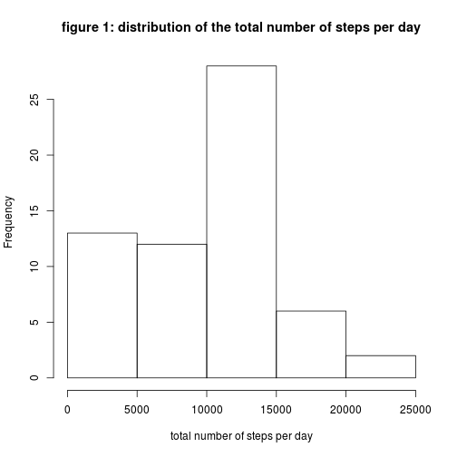
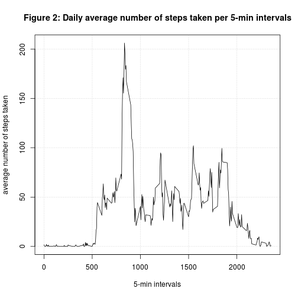
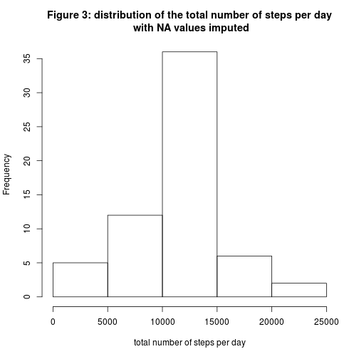
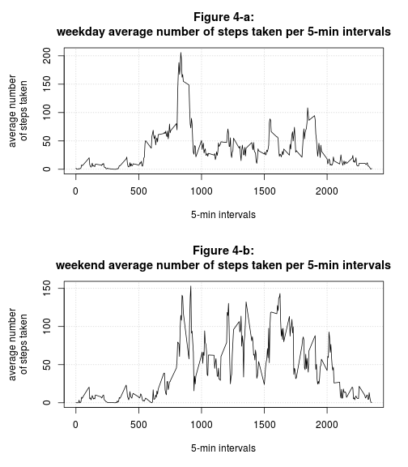

   
### Part 1: Loading and preprocessing the dataset  

The dataset [Activity Monitoring][1] used is a compressed file obtained from the Reproducible Research website. An extraction of the file "activity.csv" is first performed and then, the data is loaded into a data table for analysis. Also, the date variable is reformated to a proper type. Since the current structure of the dataset is already in a tidy form, there is not any need for further preprocessing. The following script is used to accomplish these operations.  


```r
library(knitr)
library(data.table)

# Download and decompress the data file
fileUrl <- "https://d396qusza40orc.cloudfront.net/repdata%2Fdata%2Factivity.zip";
download.file(fileUrl, destfile="activity.zip", method="wget")
unzip("activity.zip")

# Load the data from file
activity <- read.csv("activity.csv", stringsAsFactors=F, header=T)
activity <- data.table(activity)

# Reformate the date field to a suitable type
activity$date <- as.Date(activity$date)
str(activity)
```

```
## Classes 'data.table' and 'data.frame':	17568 obs. of  3 variables:
##  $ steps   : int  NA NA NA NA NA NA NA NA NA NA ...
##  $ date    : Date, format: "2012-10-01" "2012-10-01" ...
##  $ interval: int  0 5 10 15 20 25 30 35 40 45 ...
##  - attr(*, ".internal.selfref")=<externalptr>
```


### Part 2: Mean total number of steps taken per day  

In this exploratory analysis, we are interested in having a general picture of the habit of the individual's physical activity during the observation period. His mean and median total number of steps taken per day are good indicators for such analysis. One can note from the observation of the loaded data that some entries are missing (NA) and therefore, the calculated summaries can be biased. However this is a first analysis, so we don't spend much time in filling in these missing values. Instead, they are just ignore in the calculations. For each day of the observed period, we compute the total number of steps and plot its distribution for this period. Figure1 illustrates this distribution. 


```r
setkey(activity, date);
stepTotal <- activity[, j=list(total=sum(steps, na.rm=TRUE)), by=date];
hist(stepTotal$total, xlab="total number of steps per day",
     main="figure 1: distribution of the total number of steps per day");
```

 

To study the central tendency of this distribution, we compute its mean and median values as following:  


```r
totalStepMean <- round(mean(stepTotal$total, na.rm=TRUE), 1)
totalStepMedian <- median(stepTotal$total, na.rm=TRUE)
```
   
The summary show that for the entire period, an average of 9354.2 steps per day has been performed. However, the distribution' skewed form suggests that the median (50% of the distribution) with a value of 10395 steps per day, is a better indicator for the central tendency of such distribution.


### Part 3: Average daily activity pattern  

A time series plot of the 5-minute interval against the average number of steps taken (averaged across all days) is shown in Figure2.


```r
# compute the average number of steps taken per 5-min interval
setkey(activity, interval);
stepMeanPerInt <- activity[, j=list(mean=mean(steps, na.rm=TRUE)), by=interval]

# plot
with(stepMeanPerInt, plot(interval, mean, type="l", panel.first = grid(), 
                          xlab="5-min intervals", ylab="average number of steps taken",
                          main="Figure 2: Daily average number of steps taken per 5-min intervals")
    )
```

 

On a daily basis, this figure indicates that most of the activities are around 50 steps for each 5 minutes (in average) with 4 ~ 5 periods of the day where the activities approach 100 steps. Particularly, there is one 5-minute interval that displays a higher rate (~ 200 steps). To find this corresponding period, the following computation is used:   


```r
max_5min_int <- stepMeanPerInt$interval[which(stepMeanPerInt$mean == max(stepMeanPerInt$mean))]
```

This period corresponds to the interval 835.
   
   
### Part 4: Imputing the missing values

As we mentionned above, the missing recorded values for some day/interval could have introduced biases to the calculations. Our calculation of the total number of missing values in the dataset show that there are:


```r
narows <- which(is.na(activity$steps))
numNAs <- length(narows);
```
   
a total of 2304 periods which have not been filled. To remedy to this situation, our strategy for filling in all of those missing values 
is to interpolate each of them with the mean for the concerned 5-min interval across all the days. This choice is motivated by the observation that the habit of activities for individuals should be approximately the same a day to another.

We create a new data table from the initial one and then, fill in the missing observations with the corresponding average; as stated by the following script:


```r
activityNew <- copy(activity)
activityNew$steps[narows] <- round(stepMeanPerInt$mean, 0)
```

The histogram of the new dataset is shown in figure3. This distribution displays a more symetrical pattern than the previous one.


```r
setkey(activityNew, date);
stepNewTotal <- activityNew[, j=list(total=sum(steps)), by=date];
hist(stepNewTotal$total, xlab="total number of steps per day",
     main="Figure 3: distribution of the total number of steps per day\n with NA values imputed");
```

 

The resulted values of the mean and the median are computed as:


```r
totalStepNewMean <- mean(stepNewTotal$total, na.rm=TRUE)
totalStepNewMedian <- median(stepNewTotal$total, na.rm=TRUE)
summaries <- c(totalStepNewMean, totalStepNewMedian)
names(summaries) <- c("mean", "median")
round(summaries, 0)
```

```
##   mean median 
##  10766  10744
```

These values differ from the earlier estimatations. Our strategy to impute the missing data results in the change of the sample's distribution form which takes now a more gaussian-like shape. The impact is also seen about the mean and median values which are now closed to each other.

### Part 5: Activity patterns between weekdays and weekends

Another interesting question to answer is: "how are these activities distributed among the weekdays and the weekends?". To answer it, we first create a new factor variable in the dataset with two levels – “weekday” and “weekend” indicating whether a given date is a weekday or weekend day.


```r
activityNew[, daytype:=factor(weekdays(date) %in% c("Saturday", "Sunday"), labels=c("weekday", "weekend"))]
```

```
##        steps       date interval daytype
##     1:     2 2012-10-01        0 weekday
##     2:     0 2012-10-01        5 weekday
##     3:     0 2012-10-01       10 weekday
##     4:     0 2012-10-01       15 weekday
##     5:     0 2012-10-01       20 weekday
##    ---                                  
## 17564:    19 2012-11-30     2335 weekday
## 17565:     3 2012-11-30     2340 weekday
## 17566:     2 2012-11-30     2345 weekday
## 17567:     1 2012-11-30     2350 weekday
## 17568:     1 2012-11-30     2355 weekday
```

A time series plot of the 5-minute interval and the average number of steps taken, averaged across all weekdays or weekend days, is then traced. Figures 4-a and 4-b show that the concerned subject is more active during the weekend days with the activities evenly spread out during these periods.
      

```r
stepMeanPerInt <- activityNew[, j = list(mean=mean(steps)), by = list(interval,daytype)]
      
par(mfrow=c(2,1), mar=c(5.1, 5.5, 4.1, 2.1))
with(subset(stepMeanPerInt, daytype=="weekday"), 
     plot(interval, mean, type="l", panel.first = grid(), 
          xlab="5-min intervals", ylab="average number\nof steps taken",
          main="Figure 4-a:\nweekday average number of steps taken per 5-min intervals")
     )
with(subset(stepMeanPerInt, daytype=="weekend"), 
     plot(interval, mean, type="l", panel.first = grid(), 
          xlab="5-min intervals", ylab="average number\nof steps taken",
          main="Figure 4-b:\nweekend average number of steps taken per 5-min intervals")
     )
```

 


[1]: https://d396qusza40orc.cloudfront.net/repdata%2Fdata%2Factivity.zip      "Activity Monitoring"
